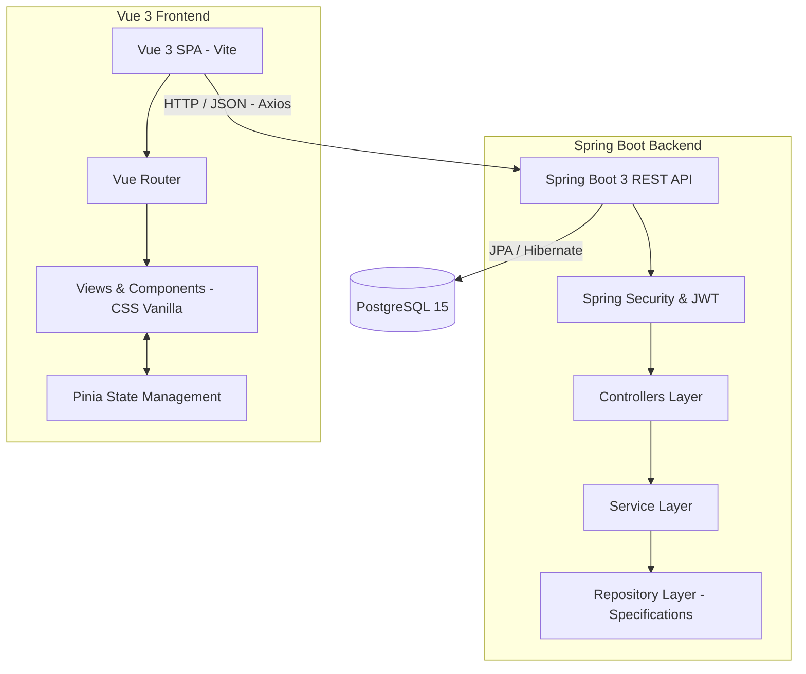

# Task Tracker Fullstack - Prueba Técnica

Aplicación de gestión de tareas construida con **Spring Boot 3 (Java)** y **Vue 3 (Vite)**, utilizando **PostgreSQL** como base de datos.
Esta solución ha sido desarrollada orquestando el uso del agente de inteligencia artificial **Antigravity** como parte activa del flujo de trabajo (Agentic Workflow).

## Arquitectura de la Solución



## Características
* **Backend Sólido:** Spring Boot 3 con Java 17+, implementando patrón MVC, Spring Data JPA con `JpaSpecification` para filtros dinámicos, y Spring Security 6 con JWT.
* **Frontend Premium:** Vue 3 + Vite, enrutador seguro, manejo de estado con Pinia, y un sistema de diseño propio basado en CSS Vanilla con *Glassmorphism*.
* **Persistencia:** PostgreSQL desplegado mediante Docker Compose.
* **Pruebas y Documentación:** Tests unitarios implementados con JUnit 5 + Mockito. API documentada con Swagger (OpenAPI).

---

## Instrucciones de Instalación y Ejecución

### 1. Base de Datos (PostgreSQL)
Asegúrate de tener Docker y Docker Compose instalados.
En la raíz del proyecto, ejecuta:
```bash
docker-compose up -d
```
Esto levantará una instancia de Postgres en el puerto `5432` con la base de datos `task_tracker` creada automáticamente.

### 2. Backend (Spring Boot)
1. Navega a la carpeta del backend: `cd backend`
2. Ejecuta el servidor (maven se encargará de instalar las dependencias):
```bash
./mvnw spring-boot:run
```
El servidor backend estará corriendo en `http://localhost:8080`.
**Documentación Swagger UI:** Puedes acceder a la API interactiva en `http://localhost:8080/swagger-ui.html`.

### 3. Frontend (Vue 3)
1. Abre otra terminal y navega a la carpeta frontend: `cd frontend`
2. Instala las dependencias de Node.js:
```bash
npm install
```
3. Inicia el servidor de desarrollo Vite:
```bash
npm run dev
```
La aplicación web estará disponible, por lo general, en `http://localhost:5173`.

---

## Flujo Agéntico (Agentic Workflow)
El registro completo de decisiones arquitectónicas, prompts e intervenciones directas generadas durante la construcción del proyecto se encuentra detallado en el archivo [AGENTIC_WORKFLOW.md](./AGENTIC_WORKFLOW.md) adjunto en la raíz del repositorio.
